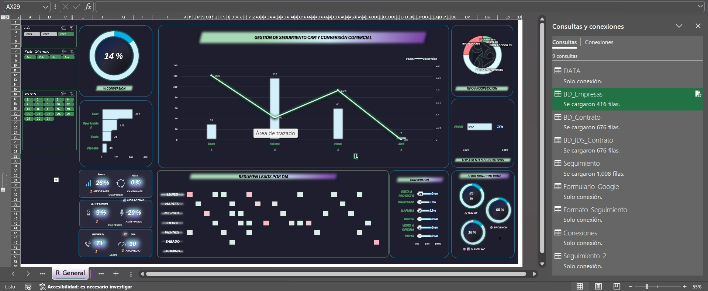
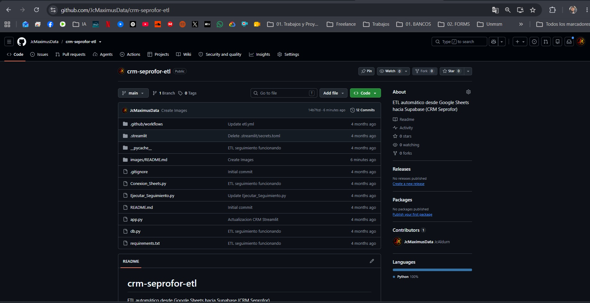
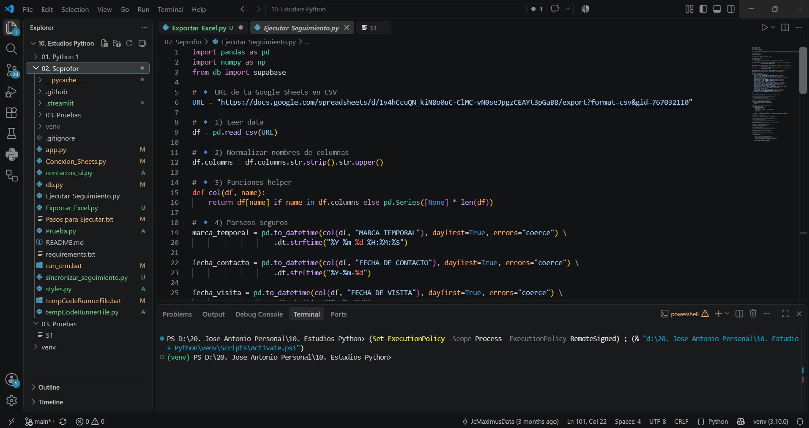
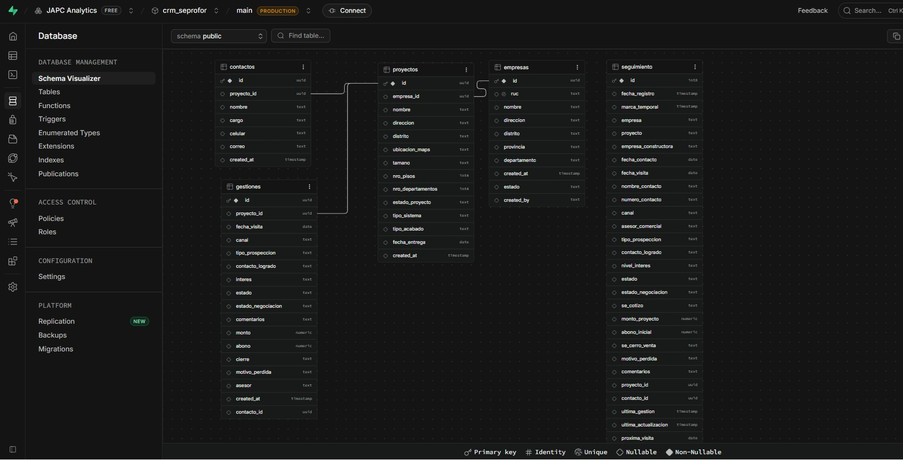
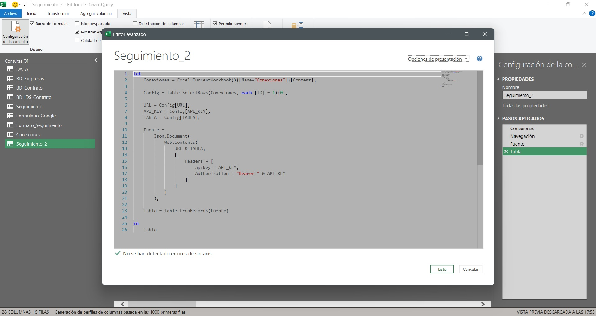
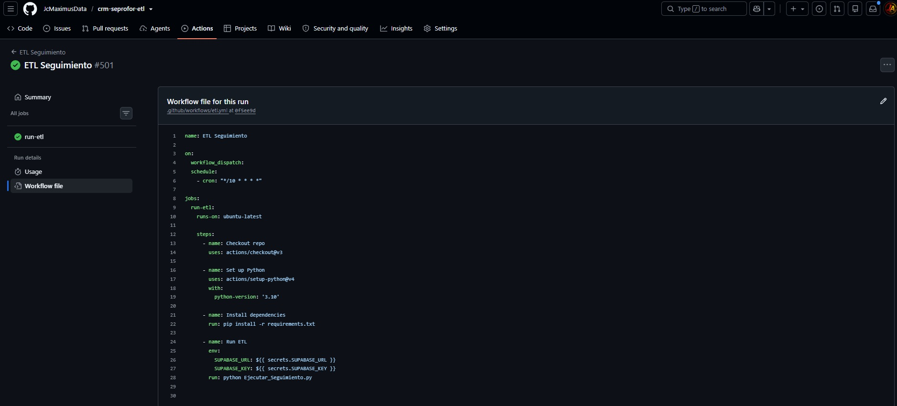
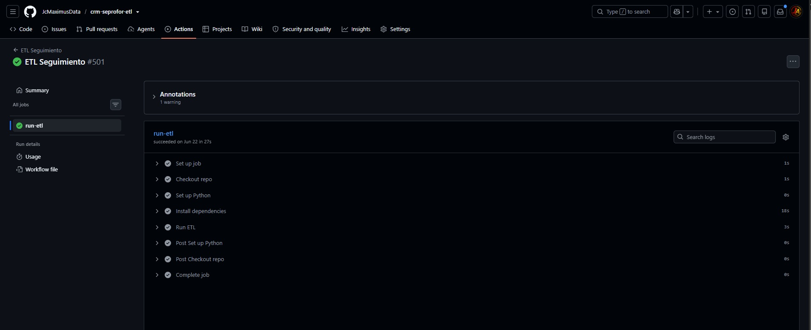

# 🚀 CRM Seprofor

## Plataforma CRM + ETL Automatizado

Sistema desarrollado para gestionar información comercial mediante una aplicación web construida con **Python** y **Streamlit**, utilizando **Supabase** como base de datos y **GitHub Actions** para automatizar la sincronización de datos desde Google Sheets.

---

## 🛠 Tecnologías

- Python
- Streamlit
- Supabase
- SQL
- Google Sheets
- GitHub Actions

---

## 🚀 Funcionalidades

- Gestión de clientes
- Seguimiento comercial
- Automatización ETL
- Integración con Google Sheets
- Base de datos en Supabase
- Reportes
- Automatización mediante GitHub Actions

---

## 📷 Capturas

### Dashboard Principal

### Gestión de Clientes

### Seguimiento Comercial

### Base de Datos (Supabase)

### Conexión y Reportes

### GitHub Actions

---

## 📌 Estado del proyecto

✅ Proyecto funcional

🔄 Mejoras futuras:

- Sistema de autenticación
- Roles de usuario
- Dashboard avanzado
- Indicadores adicionales
- Módulo de notificaciones
